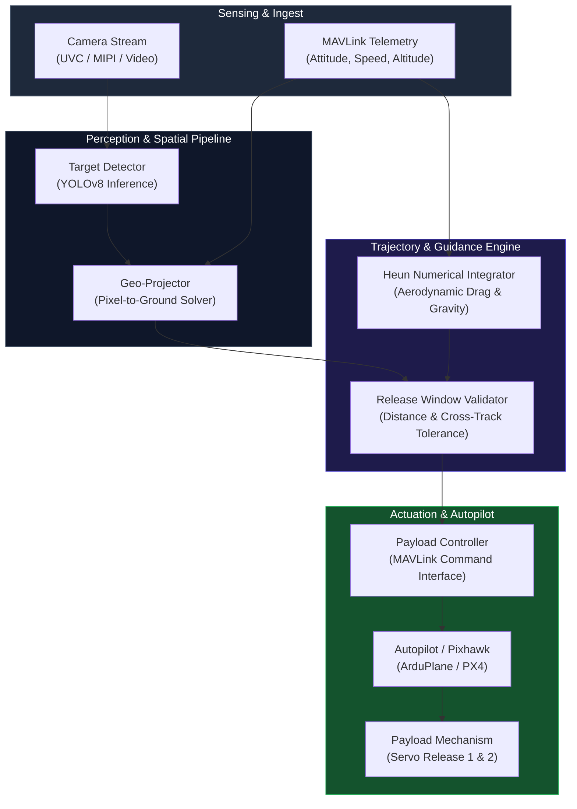

# Scandium

[](https://github.com/emrealtindag/scandium/actions/workflows/ci.yml)
[](https://github.com/emrealtindag/scandium/actions/workflows/security.yml)
[](https://www.python.org/downloads/)
[](https://opensource.org/licenses/Apache-2.0)
[](https://github.com/psf/black)
[](https://github.com/astral-sh/ruff)
[](https://mypy-lang.org/)

## Overview

**Scandium** is an autonomous airborne target acquisition, ballistic trajectory estimation, and payload delivery system designed for fixed-wing and multirotor Unmanned Aerial Vehicles (UAVs). The system operates on onboard companion computers to perform real-time target recognition, 3D world-coordinate projection, numerical ballistic impact prediction, and automated actuator deployment via MAVLink.

Developed for search-and-rescue (SAR), humanitarian aid distribution, and precision aerial delivery missions, Scandium dynamically computes release points by combining live telemetry, camera attitude, aerodynamic drag profiles, and vehicle ground speeds.

## Table of Contents

- [Overview](#overview)
- [Key Capabilities](#key-capabilities)
- [System Architecture](#system-architecture)
- [System Requirements](#system-requirements)
- [Installation](#installation)
- [Quick Start](#quick-start)
- [Configuration](#configuration)
- [MAVLink & Actuator Interface](#mavlink--actuator-interface)
- [Safety and Compliance](#safety-and-compliance)
- [License](#license)

## Key Capabilities

### Real-Time Target Detection & Tracking
Deep-learning-based visual pipeline utilizing YOLOv8 and geometric contour filtering. Supports multi-class ground target recognition, false-positive filtering, and continuous bounding-box tracking across variable lighting conditions and flight altitudes.

### Pixel-to-World Geo-Projection
Rigorous geometric transform engine mapping image-plane pixel coordinates $(u, v)$ to metric ground coordinates $(X, Y, Z)$. The solver compensates for:
- Camera intrinsic parameters (focal length, principal point, distortion)
- Fixed camera mount angles (Pitch/Roll/Yaw offsets)
- Real-time UAV attitude (Roll, Pitch, Yaw from vehicle AHRS/IMU)
- Relative flight altitude above ground level (AGL)

### Heun Ballistic Trajectory Engine
Numerical integration solver using Heun's method (Runge-Kutta 2nd order) for forward release point prediction:
- Evaluates non-linear aerodynamic drag:
  $$\mathbf{F}_d = -\frac{1}{2} \rho C_d A \|\mathbf{v}\| \mathbf{v}$$
- Ingests instantaneous airspeed, ground speed vectors, and drop altitude
- Calculates required forward release distance offset and cross-track release window in real time

### Actuator Control & MAVLink Safety
Native PyMAVLink control pipeline executing servo triggering (`MAV_CMD_DO_SET_SERVO`):
- Non-blocking `COMMAND_ACK` verification with retry loops
- Arming and flight mode safety interlocks
- Idempotent payload release states preventing accidental duplicate triggers

## System Architecture



## System Requirements

### Software Dependencies

| Component | Minimum Version | Recommended Version |
| :--- | :--- | :--- |
| Python | 3.11 | 3.12 |
| OpenCV | 4.9.0 | 4.10.0 |
| NumPy | 1.26.0 | 1.26.4 |
| Ultralytics (YOLO) | 8.1.0 | Latest |
| PyMAVLink | 2.4.41 | Latest |
| Poetry | 1.7.0 | 1.8.0+ |

### Hardware Platforms

| Hardware | Support Level | Notes |
| :--- | :--- | :--- |
| NVIDIA Jetson (Orin / Xavier) | Primary Target | CUDA-accelerated TensorRT inference |
| Raspberry Pi 4 / 5 (8GB) | Supported | CPU / NCNN inference mode |
| x86_64 Ground Station | Development & SITL | Full development and simulation platform |

## Installation

```bash
# Clone the repository
git clone [https://github.com/emrealtindag/scandium.git](https://github.com/emrealtindag/scandium.git)
cd scandium

# Install dependencies via Poetry
poetry install --with dev

# Verify environment
poetry run python -c "import scandium; print('Scandium loaded successfully')"
```

## Quick Start

### 1. Execute Integrated Pipeline (Live Video or Synthetic Playback)

```bash
# Run pipeline with a configuration file
poetry run python scripts/demo_pipeline.py --config configs/mission_fixedwing.yaml

# Run directly specifying video source and model weights
poetry run python scripts/demo_pipeline.py \
  --video-source 0 \
  --model-path models/best.pt \
  --focal-length-px 1050 \
  --mavlink-conn udp:127.0.0.1:14550
```

### 2. Run in Hardware-in-the-Loop (HITL / Serial) Mode

```bash
poetry run python scripts/demo_pipeline.py \
  --video-source /dev/video0 \
  --model-path models/best.pt \
  --mavlink-conn serial:/dev/ttyTHS1:115200
```

## Configuration

System settings are managed via YAML files and validated using runtime schemas:

```yaml
# configs/mission_fixedwing.yaml
project:
  name: "Scandium-Delivery"
  log_level: "INFO"

camera:
  source: 0
  width: 1280
  height: 720
  fps: 30
  focal_length_px: 1050.0
  mount:
    pitch_deg: 25.0   # Fixed down-pitch angle
    roll_deg: 0.0
    yaw_deg: 0.0

detection:
  model_path: "models/best.pt"
  confidence_threshold: 0.65
  use_contour_check: false

ballistics:
  payload_mass_kg: 0.350
  drag_coefficient: 0.45
  cross_sectional_area_m2: 0.008
  integration_step_s: 0.01

drop_constraints:
  release_tolerance_m: 3.0
  lateral_tolerance_m: 2.0
  min_release_altitude_m: 20.0
  max_release_altitude_m: 60.0

mavlink:
  connection: "udp:127.0.0.1:14551"
  target_system: 1
  target_component: 1
  require_arming: true
  servo_channel: 9
  pwm_payload_1: 1500
  pwm_payload_2: 2000
```

## MAVLink & Actuator Interface

Scandium issues standard MAVLink command packets (`MAV_CMD_DO_SET_SERVO`) to actuate drop doors:
- **Payload 1 Release:** Triggers Servo Channel 9 (`PWM = 1500`)
- **Payload 2 Release:** Triggers Servo Channel 9 (`PWM = 2000`)
- **Telemetry Ingest:** Continuously tracks `ATTITUDE` (Roll, Pitch, Yaw), `GLOBAL_POSITION_INT` (Relative Alt), and `VFR_HUD` (Ground Speed / Airspeed).

## Safety and Compliance

> **CIVILIAN & ETHICAL USE ONLY**  
> This software is engineered exclusively for search-and-rescue operations, humanitarian disaster relief distribution, scientific research, and commercial civilian aerial delivery.  
> Modification, integration, or deployment of this software for kinetic impact mechanisms, munitions deployment, offensive target engagement, or any destructive application is strictly prohibited under the project's license terms.

## License

Distributed under the Apache License 2.0. See [LICENSE](LICENSE) for full details.

```text
Copyright 2024-2026 Scandium Engineering Contributors

Licensed under the Apache License, Version 2.0 (the "License");
you may not use this file except in compliance with the License.
You may obtain a copy of the License at

    [http://www.apache.org/licenses/LICENSE-2.0](http://www.apache.org/licenses/LICENSE-2.0)
```
